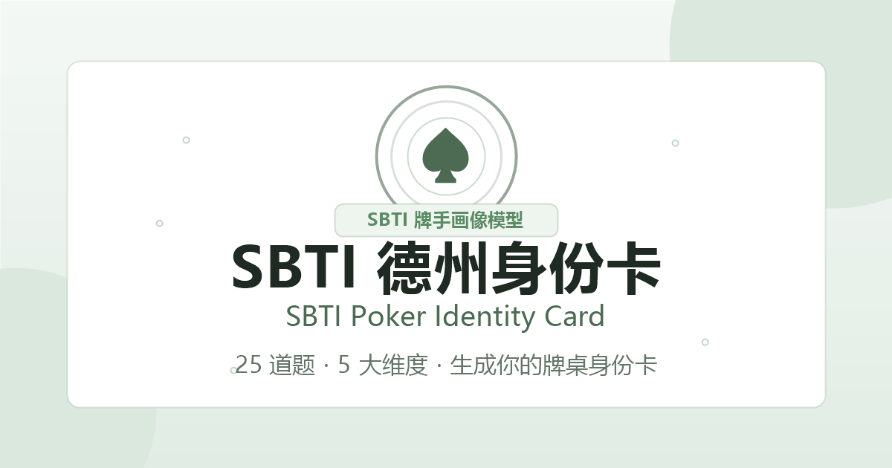

# SBTI 德州身份卡

SBTI 德州身份卡是一个基于 SBTI 牌手画像模型的德州扑克身份卡生成器。用户回答 25 道牌桌情境题后，应用会从 5 个维度计算牌手画像，并生成一张娱乐化的德州身份卡：包含牌桌身份、匹配度、五维画像、隐藏天赋、进阶身份和分享卡片。

英文名可写作 **SBTI Poker Identity Card**。这里的 SBTI 是项目内自定义的牌手画像模型命名，用来表达“用模型生成德州扑克身份卡”，不关联任何正式认证或标准机构。



## 项目定位

这个项目不是严肃的职业牌手评估工具，也不是心理测评。它更像是一个面向德州扑克玩家、牌友群、线下局和社交传播场景的小型互动应用。

核心目标：

- 用轻量问题建立一个可解释的牌手画像。
- 把抽象的牌风、情绪、策略和社交习惯转成好传播的身份卡。
- 让结果既有德州扑克语境，又适合朋友间调侃和分享。
- 保持纯静态实现，方便 GitHub Pages、Vercel 或任意静态服务器部署。

## 功能

- 25 道德州扑克情境题，覆盖常见牌桌决策、情绪反应、策略偏好和娱乐/竞技心态。
- 5 个 SBTI 维度：风险偏好、情绪控制、策略风格、社交博弈、牌桌格局。
- 15 种娱乐化牌桌身份，例如高额桌幽灵、GTO 机器人、All-in 教父、午夜收割者、快乐送财童子等。
- 结果页展示身份代号、身份描述、匹配度、五维条形画像和牌桌定位。
- 隐藏天赋与进阶身份解锁区，预留激励广告或互动解锁位。
- Canvas 生成分享卡片，适合截图、长按保存和社交传播。
- 本地数据面板，访问 `#data` 可查看当前设备上的测试漏斗、身份分布和近 7 日趋势。

## 模型思想

SBTI 模型把德州扑克玩家的牌桌行为拆成 5 个维度。每个维度都不是绝对好坏，而是描述一种倾向。

### 1. 风险偏好

衡量玩家在筹码、位置、锦标赛压力和边缘 spot 中的进攻倾向。

- 高风险：更主动进攻，愿意用筹码制造压力。
- 低风险：更重视生存、稳健和风险控制。

### 2. 情绪控制

衡量玩家面对 bad beat、挑衅、连输和大底池波动时的稳定性。

- 高控制：更接近冷静决策和 bankroll 纪律。
- 低控制：更容易上头、追损或被情绪带动下注。

### 3. 策略风格

衡量玩家更偏理论、数学、范围分析，还是更偏经验、直觉和现场感。

- 理论派：重视 GTO、solver、bet sizing、EV 和范围。
- 直觉派：重视实战经验、气势、手感和现场判断。

### 4. 社交博弈

衡量玩家是否主动读人、管理桌面形象、观察 tell 和通过聊天获取信息。

- 读人型：重视对手行为、语言、节奏和微表情。
- 独狼型：更专注牌面、数据和自己的策略，不依赖社交信息。

### 5. 牌桌格局

衡量玩家把德州扑克当作竞技、事业、训练，还是更多作为娱乐和社交活动。

- 职业心态：更系统学习、复盘、控制买入和追求长期 EV。
- 娱乐心态：更看重快乐、气氛和朋友局体验。

## 计算方式

每道题属于一个维度，选项分值为 `0 / 1 / 2`。前 4 个维度会被编码成身份类型，第 5 个维度用于生成牌桌定位。

简化流程：

```text
用户答题
  -> 5 个维度分别累计分数
  -> 前 4 个维度转换成高/低倾向代码
  -> 组合成身份 key
  -> 匹配 TYPES 中的身份文案
  -> 第 5 维匹配 MISSION_LEVELS 中的牌桌定位
  -> 渲染结果页和分享卡片
```

这种设计的重点不是复杂算法，而是“可解释 + 可扩展”：每个身份结果都能回到具体维度，后续也方便增加题库、权重和更多身份类型。

## 技术栈

项目采用纯静态前端实现，无后端依赖。

| 模块 | 技术 |
| --- | --- |
| 页面结构 | HTML5 |
| 样式 | CSS3、响应式布局、CSS 变量 |
| 交互逻辑 | 原生 JavaScript |
| 结果渲染 | DOM API |
| 分享卡片 | Canvas 2D API |
| 本地统计 | localStorage |
| 访问统计 | 51.la 脚本，可删除 |
| 部署 | GitHub Pages、Vercel、任意静态服务器 |

选择原生技术的原因：

- 项目体量小，不需要引入 React/Vue 构建链。
- 直接上传 GitHub Pages 即可运行。
- 更适合非工程化用户修改文案、题库和结果。
- 页面加载轻，适合移动端和微信/浏览器内传播。

## 文件结构

```text
.
├── index.html                    # 页面入口和 SEO / Open Graph 元信息
├── sbti-poker-card.css           # 主样式
├── sbti-poker-card.js            # 题库、模型计算、结果渲染、分享卡片
├── sbti-poker-card.min.css       # 压缩样式备份
├── sbti-poker-card.min.js        # 压缩脚本备份
├── sbti-poker-card-preview.png   # GitHub README / Open Graph 预览图
├── start-local.bat               # Windows 本地预览脚本
├── start-local.ps1               # PowerShell 本地预览脚本
├── vercel.json                   # Vercel 静态部署配置
└── .github/workflows             # GitHub Pages 自动部署工作流
```

## 本地运行

这是纯静态项目，可以直接双击 `index.html` 打开。更推荐用本地 HTTP 服务预览，避免浏览器对本地文件路径的限制。

Windows 下最简单的方式：

```bat
start-local.bat
```

或使用 PowerShell：

```powershell
.\start-local.ps1
```

如果端口被占用，可以指定端口：

```bat
start-local.bat 8081
```

```powershell
.\start-local.ps1 -Port 8081
```

也可以手动启动：

```powershell
cd C:\Users\Administrator\Desktop\SBTI
python -m http.server 8081
```

然后访问：

```text
http://localhost:8081/index.html
```

如果浏览器显示 `Directory listing for /`，并且里面是 `C:\Users\Administrator` 的用户目录，说明服务启动目录错了。请关闭那个 PowerShell 窗口，回到项目目录后重新启动。

## 部署

### GitHub Pages

仓库已包含 `.github/workflows/deploy.yml`。推送到 `main` 分支后，GitHub Actions 会自动发布静态文件到 GitHub Pages。

如果你用 GitHub 网页端上传，建议进入本地 `SBTI` 文件夹后全选里面的文件上传，不要把整个 `SBTI` 文件夹作为一个子目录拖进去。否则 GitHub 根目录会出现一个 `SBTI/` 文件夹，README 和页面入口容易不在同一级。

### Vercel

直接导入仓库即可。`vercel.json` 已按静态站点配置。

## 可定制内容

常见改动位置：

- 修改题目：编辑 `sbti-poker-card.js` 中的 `QUESTIONS`。
- 修改维度定义：编辑 `DIMENSIONS`。
- 修改身份结果：编辑 `TYPES`。
- 修改牌桌定位：编辑 `MISSION_LEVELS`。
- 修改页面文案：编辑 `index.html`。
- 修改视觉风格：编辑 `sbti-poker-card.css`。
- 修改分享卡片：编辑 `generateShareImage()` 函数。

## 后续进阶路线

### 1. 模型层

- 增加题目数量，提高每个维度的覆盖度。
- 给不同题目设置权重，区分核心问题和氛围问题。
- 增加中间态身份，不只用高/低二分。
- 输出更细的牌手雷达图，例如 preflop、postflop、tilt、table talk、bankroll discipline。

### 2. 内容层

- 为每种身份增加“适合你的训练建议”。
- 增加“最容易被哪种牌手克制”和“你最克制哪种牌手”。
- 增加朋友局/锦标赛/线上 cash 三种不同结果解释。
- 给每张身份卡设计更强的文案风格和视觉符号。

### 3. 产品层

- 支持生成长图海报和方形社交头像卡。
- 增加结果页二次分享入口，例如复制文案、保存图片、二维码。
- 增加多语言版本：中文、英文、繁体中文。
- 增加“牌友 PK”功能，两个人对比维度差异。

### 4. 工程层

- 把题库和身份配置拆成 JSON，降低非开发者修改成本。
- 加入构建脚本，自动生成压缩版 JS/CSS。
- 增加单元测试，覆盖维度计分和身份匹配逻辑。
- 增加 GitHub Actions 校验，防止语法错误和资源路径错误。

### 5. 数据层

- 把 localStorage 数据升级为可选远程统计。
- 汇总不同身份类型的分布，形成“牌友群画像”。
- 增加匿名事件统计，分析开始率、完成率、分享率和解锁率。

## 免责声明

本项目仅供娱乐和社交传播，不代表真实牌技、职业能力、心理特征或投资/赌博建议。请理性娱乐，遵守当地法律法规，珍爱 bankroll。
