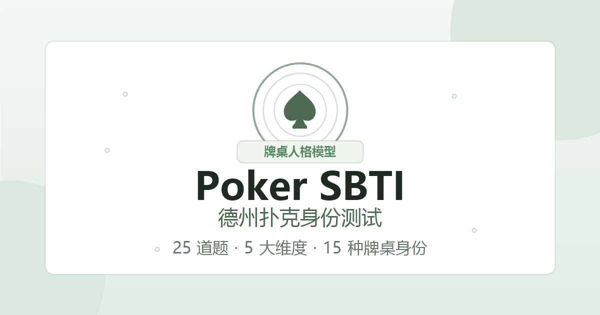

# Poker SBTI - 德州扑克身份测试

基于 SBTI 牌手画像模型的德州扑克身份测试应用。用户回答 25 道牌桌情境题后，应用会从 5 个维度生成牌桌身份、匹配度、隐藏天赋、进阶身份和分享卡片。



## 功能

- 25 道德州扑克情境题，覆盖风险偏好、情绪控制、策略风格、社交博弈、牌桌格局 5 个维度。
- 生成 15 种娱乐化牌桌身份，例如高额桌幽灵、GTO 机器人、All-in 教父、午夜收割者等。
- 支持结果页展示、隐藏天赋解锁、分享卡片生成。
- 内置本地数据面板，访问 `#data` 可查看当前设备上的测试漏斗和身份分布。
- 纯静态实现，无后端、无构建步骤，适合 GitHub Pages 或 Vercel 部署。

## 文件结构

```text
.
├── index.html              # 页面入口
├── poker-sbti.css          # 主样式
├── poker-sbti.js           # 测试逻辑和分享卡片生成
├── poker-sbti.min.css      # 压缩样式备份
├── poker-sbti.min.js       # 压缩脚本备份
├── poker-sbti-preview.png  # Open Graph / README 预览图
├── start-local.bat         # Windows 本地预览脚本
├── start-local.ps1         # PowerShell 本地预览脚本
├── vercel.json             # Vercel 静态部署配置
└── .github/workflows       # GitHub Pages 自动部署工作流
```

## 本地预览

这是一个纯静态项目，可以直接打开 `index.html`。

如果希望用本地 HTTP 服务预览，必须在项目目录运行。你的本机路径是：

```powershell
cd C:\Users\Administrator\Desktop\SBTI
python -m http.server 8080
```

然后访问 `http://localhost:8080`。

如果 `http://localhost:8080` 显示的是 `C:\Users\Administrator` 的目录列表，说明服务是在错误目录启动的。关闭那个 PowerShell 窗口，或直接换端口运行下面的脚本。

Windows 可以直接双击或运行项目内置脚本，它们会固定从当前项目目录提供文件：

```bat
start-local.bat
```

PowerShell 版本：

```powershell
.\start-local.ps1
```

如果 8080 端口已经被占用，可以换一个端口：

```bat
start-local.bat 8081
```

```powershell
.\start-local.ps1 -Port 8081
```

## 部署

### GitHub Pages

仓库已包含 `.github/workflows/deploy.yml`。推送到 `main` 分支后，GitHub Actions 会自动发布当前静态文件到 GitHub Pages。

### Vercel

直接导入仓库即可。`vercel.json` 已按静态站点配置。

## 说明

- 本项目是娱乐化测试，不代表真实牌技、职业能力或心理测评结果。
- `index.html` 中保留了 51.la 统计脚本，如不需要访问统计，可以删除对应 script。
- SBTI 是本项目的牌手画像模型命名，不关联任何正式认证或标准机构。
